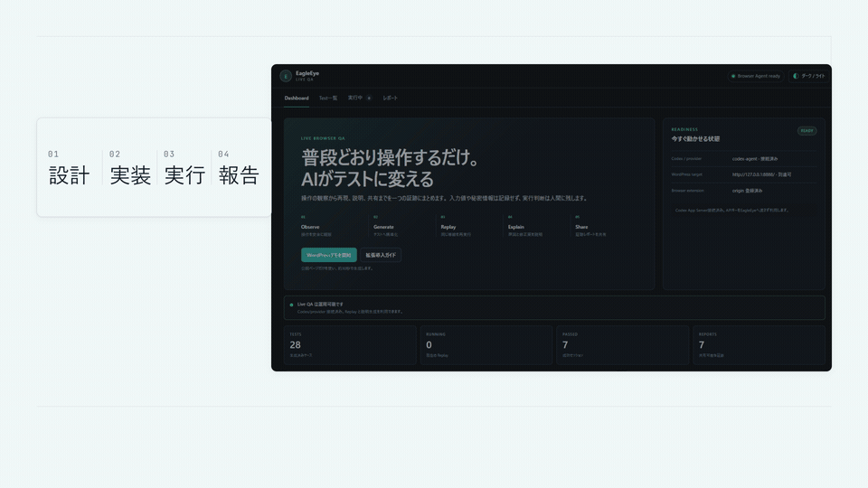

# EagleEye — Browser-Native AI QA Agent

**Discover, execute, and govern real project QA with browser replay and evidence-backed quality gates.**

**English** | [日本語](README.ja.md)

EagleEye is a local-first operational QA system. It discovers test, lint, type-check, security, integration, E2E, and build suites in explicitly approved repositories; executes them without a shell inside a confined project root; normalizes their results; and produces JSON/Markdown reports with bounded logs and SHA-256 evidence receipts. Its browser agent separately records approved journeys without retaining typed values, expands coverage through Codex App Server, and replays critical paths with Playwright.

AI can propose coverage and fixes. It cannot overwrite the recorded critical path, act as the pass/fail oracle, approve a release, or silently apply a production change.

> **Authorized testing only.** Use EagleEye only on sites you own or have explicit permission to test. Review [Privacy](PRIVACY.md), [Security](SECURITY.md), and [Compliance](COMPLIANCE.md) before recording a real site.



▶ [Watch the 2:55 English demo with burned-in captions](https://youtu.be/zLSLiG7QYr4)

The 12-second preview shows the browser observation flow. The production QA path is the Project QA runner described below; browser capture remains an optional evidence source.

## Why EagleEye

Traditional recorders preserve what happened but rarely add the edge cases a strong QA engineer would consider. Prompt-only generators can invent plausible tests without proving they are runnable.

EagleEye connects both sides:

1. Turn on the Chrome extension.
2. Use an approved website normally.
3. Record a bounded DOM summary, visible-page evidence, and the action trail in one session.
4. Ask GPT-5.6 through Codex App Server for complementary coverage.
5. Reject ambiguous, unsafe, duplicate, or assertion-free generated cases with deterministic checks.
6. Replay the recorded critical path with Playwright.
7. Export a report with screenshots, WebM evidence, byte counts, timestamps, and SHA-256 receipts.
8. Review suggested fixes and create a developer-ready bug report with one explicit action.

## Operational Project QA

Project QA supports Node.js, Python, Go, Rust, .NET, Gradle, and Maven projects. Repository owners can also add `.eagleeye/qa.json` with allowlisted command arrays. Every run requires explicit authorization, stays within `EAGLEEYE_PROJECT_ROOTS`, uses `shell=False`, applies timeouts and secret redaction, and feeds normalized results into EagleEye's deterministic quality gate.

## Quick Start — No Account Required

Requirements: Python 3.12, [uv](https://docs.astral.sh/uv/), PowerShell, and Chromium.

```powershell
git clone https://github.com/nullx2-x/eagleeye-qa-agent.git
cd eagleeye-qa-agent
Copy-Item .env.example .env
uv sync --locked --dev
uv run playwright install chromium
.\scripts\start-eagleeye.ps1
```

Start the REST dashboard and MCP service, then run QA against an authorized repository:

```powershell
.\scripts\start-eagleeye.ps1
.\scripts\start-mcp.ps1
.\scripts\run-project-qa.ps1 -ProjectRoot <authorized-project-path> -Mode development
```

Use `POST /api/v1/project-qa/discover` to review detected suites before execution. `POST /api/v1/project-qa/runs` requires `authorized=true` and returns the gate plus evidence paths and hashes.

### Load the Chrome Extension

1. Open `chrome://extensions` and enable Developer mode.
2. Select **Load unpacked** and choose `chrome-extension`.
3. Open an approved target page and select the EagleEye icon, or press `Ctrl+Shift+Y`.
4. Review the recording disclosure and confirm both site authorization and privacy consent.
5. Follow **Start → normal use → Stop → AI Generate → Replay → Report**.
6. Select **Delete this session from this device** when the evidence is no longer needed.

The extension requests only `activeTab`, `scripting`, session-only storage, and loopback API access. Incognito access is disabled. Screenshots are opt-in and are never included in the AI prompt.

## How OpenAI Is Used

Codex App Server is the OpenAI integration boundary. It owns the ChatGPT authentication lifecycle; EagleEye does not read or store ChatGPT OAuth tokens.

Each generation turn is:

- ephemeral;
- read-only;
- approval-denied;
- constrained to a strict JSON Schema;
- limited to a sanitized URL, action types, accessible target labels, the test goal, and a bounded DOM summary.

GPT-5.6 proposes complementary cases, risk observations, and repair suggestions. Deterministic Python code validates schema, quality, safety, and execution results. If AI is unavailable or times out, the recorded regression case still runs and the UI clearly labels the fallback.

Direct OpenAI API mode uses an API key. EagleEye does not pretend that the OpenAI API provides an end-user OAuth flow. `codex-agent` mode instead delegates the already connected ChatGPT login to the local Codex App Server.

## Architecture

```text
Approved browser journey
        │
        ▼
Chrome MV3 extension ── redaction + consent ──► Local FastAPI service
        │                                              │
        │                                              ├─► Deterministic critical path
        │                                              ├─► GPT-5.6 via Codex App Server
        │                                              └─► Test quality checker
        │                                                       │
        └───────────────────────────────────────────────────────▼
                                                   Playwright Replay
                                                           │
                                                           ▼
                                      HTML / Markdown report + evidence receipts
```

See the detailed [architecture notes](docs/build-week/architecture.md) and [architecture diagram](docs/build-week/screenshots/architecture-flow.png).

## Privacy by Input Contract

EagleEye does not collect or retain:

- form values;
- passwords or one-time codes;
- cookies;
- authentication headers;
- `FormData` payloads;
- payment data;
- credentials, URL fragments, or secret-like query parameters.

Input events are recorded only as an action type with `redacted=true`. Visible titles, headings, and control labels can still contain personal information, so do not start recording on sensitive medical, financial, identity, employment, or child-related screens without additional controls.

Local sessions can be deleted through the extension UI or API. Remote or multi-user deployment is not enabled by default and requires TLS, strong authentication, access control, retention limits, encrypted backups, audit logging, and deletion procedures.

## Core Capabilities

- Browser observation with explicit consent and privacy redaction
- Natural-language test intent
- GPT-5.6 test generation through Codex App Server
- Deterministic pre-execution case quality checks
- Playwright replay with screenshot and WebM capture
- SHA-256, byte count, MIME type, timestamp, and source metadata
- Risk-adaptive `LIGHT`, `DEVELOPMENT`, `STANDARD`, `STRICT`, and `RELEASE_GATE` modes
- Change-impact analysis and full-regression escalation for high-risk changes
- Flaky-test separation from ordinary failures
- HTML and Markdown reports
- One-click Markdown bug report generation
- Human-bounded repair proposals and rollback-safe local self-repair gates
- Streamable HTTP MCP integration and Codex skills
- Separate guided human QA sessions with runner-bound attestation
- Local-provider fallback with Ollama or LM Studio
- Multi-ecosystem Project QA discovery and execution with root confinement
- Normalized suite results and evidence-backed aggregate quality gates

## Service Endpoints

```powershell
.\scripts\start-eagleeye.ps1
.\scripts\start-mcp.ps1
```

| Service | URL |
|---|---|
| Dashboard and API | `http://127.0.0.1:8766` |
| MCP | `http://127.0.0.1:8768/mcp` |
| Guided QA fixture | `http://127.0.0.1:8767` |

Project QA endpoints:

- `POST /api/v1/project-qa/discover`
- `POST /api/v1/project-qa/runs`
- `GET /api/v1/project-qa/runs/{runId}`

`POST /api/v1/quality-gates/evaluate` activates emulator compatibility tests only when both
`serviceType=emulator` and `compatibilityLevel` are explicit. A compatibility level on a
non-emulator request is rejected with HTTP 422.

FastAPI `/docs` and `/openapi.json` are disabled by default. Enable them only for loopback development with `EAGLEEYE_ENABLE_API_DOCS=1`.

## AI Providers

| Provider | Authentication | Notes |
|---|---|---|
| Codex Agent | Codex App Server managed ChatGPT OAuth | Recommended OpenAI path; EagleEye never receives the token |
| OpenAI API | API key | Direct API mode |
| Anthropic | API key or OIDC WIF exchange | Organization configuration required |
| Google Gemini | Authorization Code + PKCE or API key | Desktop OAuth client or key required |
| Azure OpenAI | Entra PKCE, Azure Identity, or API key | Entra app and Azure RBAC required |
| GitHub Models | OAuth Device Flow or token | User consent required |
| Ollama | Local, no authentication | Default local advisory provider |
| LM Studio | Local, optional API key | Local server required |

Credentials are never returned in API responses. Supported credentials are stored in the operating-system keychain.

## Security Boundaries

- Loopback-only API binding by default
- Exact CORS origin allowlist; wildcards are rejected
- Restricted Host headers and defensive response headers
- PKCE S256, state validation, flow expiry, and HTTPS OAuth endpoints
- Fixed desktop-target registry; no arbitrary command or path execution
- `shell=False`, minimal subprocess environment, root confinement, and process-tree timeout termination
- Secret redaction for bearer tokens, API keys, JWTs, GitHub tokens, AWS access keys, and URL credentials
- Fail-closed self-repair requiring a local non-production target, clean Git state, fresh one-use attestation, strict file/line limits, fixed verification, and rollback
- Explicit human approval for repair application, destructive actions, and release decisions

See [SECURITY.md](SECURITY.md) for reporting and operational details.

## Verification

```powershell
uv run ruff check .
uv run pytest -q
```

Latest release review:

- 169 Python tests passed
- Ruff lint and format passed
- Chrome extension privacy/security verifier and ESLint passed
- Gitleaks found zero leaks across the sanitized submission history
- Fixed Python dependencies had zero known PyPI advisories
- `npm audit` reported zero known vulnerabilities after pinning patched `adm-zip 0.6.0`
- HyperFrames runtime, layout, and motion checks passed
- Final demo video decoded end to end: 2:55, 1080p, English narration, 72 burned-in English subtitle cues

Run the complete operational gate with:

```powershell
.\scripts\quality-gate.ps1
```

## Build Week Materials

- [Architecture](docs/build-week/architecture.md)
- [Demo script](docs/build-week/demo-script.md)
- [Devpost submission](docs/build-week/devpost-draft.md)
- [Release audit](docs/release/1.0.0-publication-audit.md)
- [Phase 1–9 submission checklist](docs/build-week/submission-checklist.md)
- [Publication security procedure](docs/build-week/publication-security.md)
- [Submission screenshots](docs/build-week/screenshots/)
- [Privacy](PRIVACY.md)
- [Security](SECURITY.md)
- [Compliance](COMPLIANCE.md)

## Human Responsibility

EagleEye assists with observation, test generation, replay, evidence, and bounded proposals. A human remains responsible for authorization, sensitive-data handling, production changes, legal consent, release approval, and final publication.

## License

[MIT](LICENSE)
