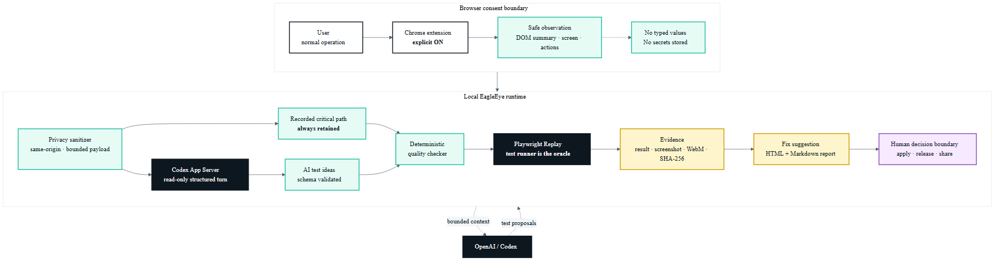
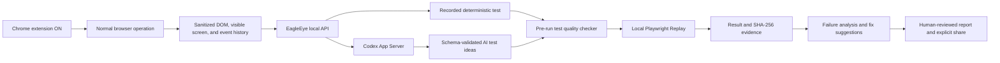
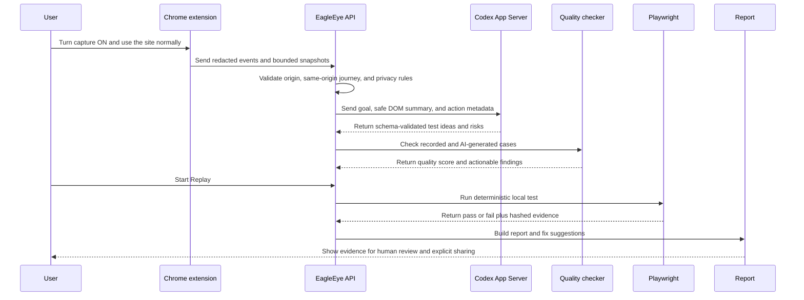

# EagleEye architecture for OpenAI Build Week

## One-sentence value proposition

EagleEye turns a real browser journey into a privacy-aware, AI-augmented regression test, replays it locally, and packages the result, evidence, and fix suggestions for a human decision.

## The winning path

This is the implemented local submission flow. The implementation-status table below separates current proof from release-gated public distribution.

## Why this architecture matters

Traditional recorders preserve clicks. Standalone LLM test generators invent tests without seeing the actual product journey. EagleEye combines both:

1. The recording remains the deterministic critical path, even when AI is unavailable.
2. OpenAI receives a bounded, redacted summary of the journey and proposes complementary edge cases rather than replacing the recorded path.
3. Every generated case is checked before execution for ambiguity, weak assertions, unstable selectors, secrets, duplication, and unsafe scope.
4. Replay produces evidence; the model does not declare its own output correct.
5. Repair stays behind a human approval boundary, with a proposal-only path as the default.

## Component model

| Component | Responsibility | Primary boundary | Current status |
|---|---|---|---|
| Chrome capture extension | Explicit ON/OFF capture, safe DOM summary, optional visible-page screenshot, and interaction metadata | Browser permission and user consent | **IMPLEMENTED / E2E-VERIFIED** - fixed-ID Manifest V3 source, static verifier and ESLint pass; fresh unpacked Chromium proved OFF delta `0` and explicit-ON capture |
| Browser-agent REST surface | Session creation, observations, generation, Replay, report, screenshot, and bug-report endpoints | Loopback API and exact extension origin | **IMPLEMENTED / E2E-VERIFIED** - the same browser session completed observation, generation, Replay, HTML report, and explicit Markdown export |
| Privacy sanitizer | Removes secret query fields, rejects unsafe input at the bundle boundary, and avoids storing typed values | All browser content is untrusted | **IMPLEMENTED / TESTED** - negative API tests cover unsafe fields, query cleanup, screenshot bounds, confinement, and report escaping; the extension stores summaries rather than raw input values |
| Strategy and case checker | Risk-adaptive profile plus mechanical test-quality checks | Deterministic policy cannot be removed by AI | **IMPLEMENTED** |
| Codex provider | Structured model turns through Codex App Server | App Server owns authentication; EagleEye does not receive the token | **IMPLEMENTED / LIVE-VERIFIED** - the WordPress browser session returned five schema-valid cases from `codex-agent` / `gpt-5.6-terra`, available `true`, fallback `false` |
| Playwright runner | Local deterministic Replay and result capture | Localhost by default; remote execution is opt-in | **IMPLEMENTED** |
| Evidence store | Atomic result writes and screenshot/video metadata with hashes | Repository-confined runtime directories | **IMPLEMENTED / E2E-VERIFIED** - browser report shows kind, bytes, timestamp, capture source, and SHA-256 for screenshot and WebM |
| Analyzer and repair handoff | Failure category, likely cause, recommended action, and bounded repair path | Explicit approval and fail-closed policy | **IMPLEMENTED** |
| Report and sharing | Human-readable result, generated cases, evidence, suggestions, and explicit Markdown bug-report export | No implicit public upload | **IMPLEMENTED LOCAL-FIRST** - HTML and attachment export are tested; authenticated public hosting is deliberately not claimed |

## Request and evidence sequence

## OpenAI integration

EagleEye integrates with **Codex App Server**, the OpenAI interface intended for deep product integrations that need authentication, approvals, and streamed agent events. The official protocol supports newline-delimited JSON over the default stdio transport. See the [Codex App Server documentation](https://learn.chatgpt.com/docs/app-server).

The implemented provider path:

- delegates ChatGPT account authentication and account state to Codex App Server;
- initializes the App Server connection and starts a structured turn;
- constrains the turn to read-only operation with approval denied for model-initiated actions;
- requires JSON matching an output schema instead of parsing prose;
- sends a bounded browser prompt containing the test goal, sanitized target, action types, target labels, and a safe DOM summary;
- treats the browser page, labels, URLs, and DOM text as untrusted data, never as instructions;
- falls back to the deterministic recorded case when AI is unavailable.

The model proposes cases, risks, and improvements. EagleEye's deterministic code owns policy checks, Replay, evidence collection, and the final gate.

## Data minimization and safety

The implemented design uses the following controls. Static extension checks, the Python suite, and a fresh unpacked-Chromium WordPress run pass; public release still requires the separate publication gate.

- **Local-first:** API and browser execution bind to loopback by default.
- **Exact extension origin:** wildcard Chrome extension origins are rejected.
- **Same-origin recording:** a recording cannot silently cross from the starting site to another origin.
- **No typed values:** input-bearing events store action and field metadata, not the user's raw value.
- **Secret-type rejection:** password, OTP, card, and secret fields are not accepted as recording inputs.
- **URL cleanup:** secret-like query parameters and fragments are removed before persistence or prompting.
- **Bounded screenshots:** only PNG/JPEG data URLs within the configured size limit are accepted.
- **Prompt-injection resistance:** page text is treated as untrusted evidence and the AI turn cannot write to the product.
- **Escaped reports:** untrusted target names and page content are escaped before HTML rendering.
- **Human authority:** production writes, release approval, and fix application remain explicit human decisions.

## Failure behavior

EagleEye is designed to fail visibly:

- If OpenAI is unavailable, the recorded critical-path test remains available and the report labels AI fallback use.
- If a case is ambiguous or unsafe, the quality checker reports the defect before Replay.
- If Replay fails, the runner stores the error and evidence, then the analyzer produces a categorized recommendation.
- If bounded repair eligibility, a clean repository, fresh attestation, or an explicit apply request is missing, automatic modification is refused.
- If the Chrome extension or browser-agent routes are not integrated, the Build Week demo gate fails; the submission must not simulate that path.

## Deployment boundary

The current product is a single-user local QA service. It is not presented as a multi-tenant SaaS, autonomous release approver, or safely exposed LAN service. Shared-host or remote deployment requires an authenticated gateway, per-user authorization and auditing, retention policy, and a fresh threat review.

## Submission proof

The local proof bundle now contains:

1. A fixed-ID unpacked extension in a fresh Chromium profile, with OFF delta `0` and explicit ON activation.
2. Four ordered observations from the previously tested local WordPress site.
3. Five cases from live Codex App Server generation, separately labelled from the retained recorded case.
4. A Playwright Replay from the same session: `PASS`, `1,745 ms`, case-quality score `100`.
5. Screenshot (`103,299` bytes) and WebM (`112,935` bytes) evidence with timestamps and SHA-256.
6. A sanitized HTML report, visible fix suggestions, and an explicit Markdown bug-report attachment.
7. Six current product screenshots, one Architecture image, and a machine-readable E2E record under `docs/build-week/`.

Still release-gated: a green remote Windows/Linux GitHub Actions run on the public commit, unauthenticated checks of the final public GitHub/video URLs, and Devpost's final submit action. These are external-state gates, not missing local product features.
